# Boss MCP 2.x Current Status And Process Design

Last updated: 2026-05-03 Asia/Shanghai.

Package: `@reconcrap/boss-recommend-mcp`
Current released version: `2.0.1`
GitHub release: `v2.0.1`
Primary runtime entrypoint: `src/index.js`
Primary CLI entrypoint: `src/cli.js`
Published binary: `boss-recommend-mcp`

This document is a guidebook for future AI agents and maintainers. It describes the current production shape, the process contracts, and the exact operational flows that must remain true during bug fixes, upgrades, or future refactors. If this document and code disagree, code is the source of truth, but the next maintainer should update this document in the same change.

## Current Product Status

The 2.x line is a CDP-only rewrite of the Boss recommend/search/chat MCP package.

Current shipped capabilities:

- Recommend page screening on `https://www.zhipin.com/web/chat/recommend`.
- Recommend job list discovery with `list_recommend_jobs`.
- Recommend page scopes: `推荐` / `精选` / `最新`, internally `recommend` / `featured` / `latest`.
- Search/recruit page screening on `https://www.zhipin.com/web/chat/search`.
- Chat page screening and CV request flow on `https://www.zhipin.com/web/chat/index`.
- Shared run lifecycle: start, get status, pause, resume, cancel, checkpoint, cleanup.
- Shared screening and CSV output compatible with the legacy CSV shape.
- Network-first CV acquisition with full-scroll image fallback.
- Infinite-list processing with duplicate prevention, end-of-list detection, and refresh-round support.
- Shared self-heal probe engine for selector/accessibility/network health checks.
- Installer migration for legacy MCP/skill setups on Windows and macOS, including Trae, Trae CN, and OpenClaw.

The active package must not use:

- `Runtime.evaluate`
- page JS snippets
- direct DOM scripting inside the page context
- legacy local `vendor/` browser automation
- active imports from `legacy/research/`

The package is published with a narrowed npm surface. Clean npm installs include only runtime files, bundled skills, `scripts/postinstall.cjs`, config example, and README. They intentionally exclude `docs/`, `legacy/`, `vendor/`, live harness scripts, scanner scripts, and development tests.

## Live Gate Status

The rewrite plan uses live-gated completion. Mock/unit tests are useful only as development support. They are not completion criteria.

Current completed gates recorded before the 2.0 release:

- Recommend full live Phase 10 run with 20+ processed/screened candidates.
- Search/recruit full live Phase 10 run with 20+ processed/screened candidates.
- Chat full live Phase 10 run with 20+ processed/screened candidates.
- Static/package boundary gate with zero active forbidden runtime usage.
- Clean package install smoke verified no legacy/vendor package leakage.

Current post-release validation for `2.0.1`:

- `npm run test:installer-migration`
- `npm run test:recommend-mcp`
- `npm run test:recruit-mcp`
- `npm run test:chat-mcp`
- `npm run test:runtime-scan`
- `npm run gate:phase9-static`
- `npm run scan:package-boundary`

Any future behavioral change touching live browser automation must add or rerun an appropriate live validation. A module should not be called complete unless live results are reviewed and recorded in `docs/REWRITE_STATUS.md` or a successor status ledger.

## Source Layout

```text
bin/boss-recommend-mcp.js          npm binary wrapper
src/index.js                       MCP JSON-RPC server and tool dispatch
src/cli.js                         CLI, installer, migration, doctor, local helpers
src/recommend-mcp.js               Recommend MCP tool wrappers and durable artifacts
src/recruit-mcp.js                 Search/recruit MCP tool wrappers and durable artifacts
src/chat-mcp.js                    Chat MCP tool wrappers and durable artifacts
src/chat-runtime-config.js         Shared config/runtime path resolution
src/parser.js                      Recommend instruction parser
src/run-state.js                   Durable recommend run-state store
src/core/browser                   CDP-only browser primitives and Runtime guard
src/core/capture                   DOM HTML and screenshot/full-scroll capture
src/core/cv-acquisition            Network-primary/image-fallback decision state
src/core/greet-quota               Greet quota parsing and exhaustion guard
src/core/infinite-list             Infinite-list dedupe, scroll, and end detection
src/core/reporting                 Legacy-compatible CSV output
src/core/run                       In-memory lifecycle manager used by domains
src/core/screening                 Candidate normalization, LLM calls, screening
src/core/self-heal                 Health probes and drift reports
src/domains/recommend              Recommend page roots, jobs, scopes, filters, cards, detail, actions, run-service
src/domains/recruit                Search page roots, search filters, cards, detail, actions, refresh, run-service
src/domains/chat                   Chat page roots, jobs, filters, cards, detail, CV request, run-service
skills/boss-recommend-pipeline     Bundled recommend skill
skills/boss-recruit-pipeline       Bundled search/recruit skill replacing legacy boss-recruit-mcp
skills/boss-chat                   Bundled chat skill replacing standalone boss-chat
legacy/research                    Inert research archive, not published to npm
```

## Global Invariants

These invariants are more important than individual implementation details:

- Browser access must go through `src/core/browser/index.js` or domain helpers that use it.
- All CDP calls must be logged through the guarded client.
- Any `Runtime.*` call must fail immediately.
- DOM state is read with CDP `DOM` and, where useful, `Accessibility`.
- User interaction is performed with CDP `Input` based on live `DOM.getBoxModel` centers, not hard-coded screen coordinates.
- Network resume capture is preferred because it is faster and cheaper.
- Full-scroll image fallback must remain available for recommend, search/recruit, and chat when network CV capture is unavailable.
- Recommend production screening must open candidate detail/CV by default up to the target count. `detail_limit: 0` is debug-only and is ignored unless `allow_card_only_screening=true`.
- Candidate list pages are infinite scroll pages. The code must prevent double-screening and must not miss visible candidates between scrolls.
- Recommend/search refresh rounds must force "recent not viewed" filtering when trying another round after list end.
- Search and recommend filters must support multiple selections.
- Chat must never open `c-resume` by direct URL. It must reach online resume views through UI CDP interactions only.
- Visual inspection is a test mechanism only. It must not become a product runtime requirement.
- LLM candidate screening asks only for pass/fail and chain-of-thought capture; it should not request user-facing reasons to reduce output tokens.
- CSV output must preserve user input conditions and full LLM CoT in the legacy-compatible output format.
- Legacy code is retained only under `legacy/research/` for future research.

## Status Codes And Common States

Top-level MCP payload status values:

- `NEED_INPUT`: caller must provide missing values.
- `NEED_CONFIRMATION`: caller must confirm proposed values before execution.
- `ACCEPTED`: async run was started and a `run_id` was returned.
- `COMPLETED`: operation completed.
- `FAILED`: operation failed; inspect `error.code`, `error.message`, and `retryable`.

Run lifecycle statuses:

- `queued`
- `running`
- `paused`
- `completed`
- `failed`
- `canceling`
- `canceled`

Important intentional fences:

- `boss-recommend-mcp run` returns `RECOMMEND_CLI_RUN_UNSUPPORTED_CDP_ONLY`.
- `boss-recommend-mcp chat run` and `boss-recommend-mcp chat start-run` return `CHAT_CLI_ASYNC_UNSUPPORTED_CDP_ONLY`.
- `boss-recommend-mcp calibrate` returns `CALIBRATE_UNSUPPORTED_CDP_ONLY`.
- `run_featured_calibration` returns `FEATURED_CALIBRATION_UNSUPPORTED_CDP_ONLY`.
- Detached legacy recommend workers are fenced with `DETACHED_LEGACY_PIPELINE_UNSUPPORTED_CDP_ONLY`.

## Process Flowcharts

### Architecture Overview


Source: [editable Mermaid source](visuals/process/source/00-architecture-overview.mmd)

### Process Flowchart Index

- [1. New Codex Session / Maintenance Entry Flow](visuals/process/01-new-codex-session-maintenance-entry-flow.svg)
- [2. Installer And Legacy Migration Flow](visuals/process/02-installer-and-legacy-migration-flow.svg)
- [3. MCP JSON-RPC Server Dispatch Flow](visuals/process/03-mcp-json-rpc-server-dispatch-flow.svg)
- [4. CDP-Only Browser Session Flow](visuals/process/04-cdp-only-browser-session-flow.svg)
- [5. Recommend Job List Flow](visuals/process/05-recommend-job-list-flow.svg)
- [6. Recommend Start Tool Confirmation Flow](visuals/process/06-recommend-start-tool-confirmation-flow.svg)
- [7. Recommend Domain Workflow](visuals/process/07-recommend-domain-workflow.svg)
- [8. Recruit/Search Workflow](visuals/process/08-recruit-search-workflow.svg)
- [9. Chat Prepare And Start Flow](visuals/process/09-chat-prepare-and-start-flow.svg)
- [10. Chat Domain Workflow And CV Request Flow](visuals/process/10-chat-domain-workflow-and-cv-request-flow.svg)
- [11. CV Acquisition Cascade](visuals/process/11-cv-acquisition-cascade.svg)
- [12. Infinite List Dedupe And End Detection](visuals/process/12-infinite-list-dedupe-and-end-detection.svg)
- [13. Lifecycle Control Flow](visuals/process/13-lifecycle-control-flow.svg)
- [14. Self-Heal Flow](visuals/process/14-self-heal-flow.svg)
- [15. Screening And CSV Flow](visuals/process/15-screening-and-csv-flow.svg)
- [16. Static And Package Gate Flow](visuals/process/16-static-and-package-gate-flow.svg)

### 1. New Codex Session / Maintenance Entry Flow


Source: [editable Mermaid source](visuals/process/source/01-new-codex-session-maintenance-entry-flow.mmd)

### 2. Installer And Legacy Migration Flow


Source: [editable Mermaid source](visuals/process/source/02-installer-and-legacy-migration-flow.mmd)

Expected behavior:

- Non-Boss MCP servers are preserved.
- Legacy Boss MCP entries are removed from the same `mcp.json`.
- New `boss-recommend` route points to the unified package.
- External skill directories receive all three bundled skills.
- Existing files are backed up before mutation.
- Windows and macOS app support paths are both considered.

### 3. MCP JSON-RPC Server Dispatch Flow


Source: [editable Mermaid source](visuals/process/source/03-mcp-json-rpc-server-dispatch-flow.mmd)

### 4. CDP-Only Browser Session Flow


Source: [editable Mermaid source](visuals/process/source/04-cdp-only-browser-session-flow.mmd)

### 5. Recommend Job List Flow


Source: [editable Mermaid source](visuals/process/source/05-recommend-job-list-flow.mmd)

### 6. Recommend Start Tool Confirmation Flow


Source: [editable Mermaid source](visuals/process/source/06-recommend-start-tool-confirmation-flow.mmd)

### 7. Recommend Domain Workflow


Source: [editable Mermaid source](visuals/process/source/07-recommend-domain-workflow.mmd)

Important recommend behavior:

- `target_count` means processed candidates, not passed candidates.
- Page scopes are selected after job selection.
- If requested scope is unavailable, the run falls back to `推荐`.
- School and degree filters can select multiple labels.
- At end of list, recommend tries the bottom `刷新` button if available before page refresh.
- Refresh rounds force recent-not-view filtering.
- Greet action stops the run if quota text indicates exhausted credits.

### 8. Recruit/Search Workflow


Source: [editable Mermaid source](visuals/process/source/08-recruit-search-workflow.mmd)

Important search/recruit behavior:

- Search uses the job selector next to the keyword input. If the user did not provide a job, the agent/tool should ask.
- City `全国` is selected under `城市 -> 热门 -> 全国`.
- Illegal city names must default to `全国`, not fail the entire run.
- Multiple degrees and school tags are supported.
- Search refresh has no guaranteed bottom `刷新` button, so it may refresh the page and reapply filters.
- Refresh rounds force filtering out recently viewed candidates.

### 9. Chat Prepare And Start Flow


Source: [editable Mermaid source](visuals/process/source/09-chat-prepare-and-start-flow.mmd)

Important chat target-count semantics:

- Numeric `target_count` means number of candidates that pass screening.
- `all`, `-1`, `unlimited`, `全部`, `不限`, `扫到底`, `全量`, `全部候选人`, and `所有候选人` mean scan until list end.
- If all candidates are processed and the target pass count was not reached, the run is still completed.

### 10. Chat Domain Workflow And CV Request Flow


Source: [editable Mermaid source](visuals/process/source/10-chat-domain-workflow-and-cv-request-flow.mmd)

Important chat behavior:

- Chat should process each candidate once. Reopening the same candidate repeatedly is a bug unless there is an explicit recovery retry.
- If a candidate card is below viewport, the infinite-list layer must scroll to reveal it.
- The runtime must not navigate directly to `https://www.zhipin.com/web/frame/c-resume/...`.
- Request CV flow must check whether the CV is already available/requested, send a message when necessary to activate the request button, click request CV, and verify the request.

### 11. CV Acquisition Cascade


Source: [editable Mermaid source](visuals/process/source/11-cv-acquisition-cascade.mmd)

Expected behavior:

- Network capture is always attempted first.
- If network capture repeatedly misses in the same run, the wait plan shortens so the tool switches to image fallback faster.
- Image fallback must scroll through the full CV, not capture only the current viewport.
- The method may vary across separate runs; the state machine must tolerate alternating network/image availability.

### 12. Infinite List Dedupe And End Detection


Source: [editable Mermaid source](visuals/process/source/12-infinite-list-dedupe-and-end-detection.mmd)

Expected behavior:

- Duplicate prevention must use stable candidate keys, not visible index alone.
- The list can re-render, invalidating node IDs. Domain code should reacquire fresh node IDs when needed.
- Scroll-end detection must be based on stable signatures and scroll attempts, not a single failed scroll.

### 13. Lifecycle Control Flow


Source: [editable Mermaid source](visuals/process/source/13-lifecycle-control-flow.mmd)

Expected behavior:

- Pause is cooperative; it takes effect at safe checkpoints.
- Resume keeps the same `run_id`, CSV, and checkpoint path.
- Cancel should cleanly stop future candidate actions.
- Get-run must be safe to call repeatedly.

### 14. Self-Heal Flow


Source: [editable Mermaid source](visuals/process/source/14-self-heal-flow.mmd)

Expected behavior:

- Self-heal is an explicit maintenance tool, not automatically injected into normal runs.
- Unavailable pages are environment blockers, not passes.
- Probe failures should describe missing selectors/root causes clearly.

### 15. Screening And CSV Flow


Source: [editable Mermaid source](visuals/process/source/15-screening-and-csv-flow.mmd)

Expected behavior:

- LLM output should be compact for pass/fail.
- Full CoT is recorded in CSV/report for audit.
- User input conditions must be recorded in the input section of CSV.
- Result rows should preserve candidate identity, source, pass/fail, action result, timing, and evidence metadata.

### 16. Static And Package Gate Flow


Source: [editable Mermaid source](visuals/process/source/16-static-and-package-gate-flow.mmd)

## Per-Domain Process Contracts

### Recommend Contract

Inputs that must be preserved:

- `instruction`
- `confirmation`
- `overrides`
- `page_scope`
- `school_tag`
- `degree`
- `gender`
- `recent_not_view`
- `criteria`
- `target_count`
- `post_action`
- `max_greet_count`
- `job`

Behavior:

- Ask for missing or unconfirmed values before browser work.
- Read job options only after page readiness.
- Require final confirmation before async start.
- Use DOM/Input only for all UI interaction.
- Leave selected filters applied for real runs.
- Use network CV first, image fallback second.
- Write CSV and JSON reports under the run artifact directory.

### Search/Recruit Contract

Inputs that must be preserved:

- `instruction`
- `job`
- `keyword`
- `city`
- `degree`
- `school_tag`
- `recent_not_view`
- `criteria`
- `target_count`
- `post_action`
- `max_greet_count`

Behavior:

- Require user-provided job. If missing, ask.
- Apply exact search filters before screening.
- Support multi-select degree/school filters.
- Treat illegal city as `全国`.
- On refresh rounds, reapply the same keyword/job/filter search and force recent-viewed filtering.
- Write legacy-compatible CSV with all user conditions.

### Chat Contract

Inputs that must be preserved:

- `job`
- `start_from`
- `target_count`
- `criteria`
- `greeting_text`
- `profile`

Behavior:

- `prepare_boss_chat_run` must be used to fetch job options before start in agent workflows.
- `start_boss_chat_run` requires all required inputs.
- `unread` and `all` are distinct start pages.
- `target_count=all` means scan to end.
- Request CV only for passed candidates.
- Skip CV request if `附件简历` or equivalent indicates the CV is already available/requested.
- Send a chat message if required to activate the request CV button.
- Verify request sent.

## Release Process Contract

Before publishing a patch/minor version:

1. Update `package.json` and `package-lock.json`.
2. Run focused tests for the changed area.
3. Run `npm run test:runtime-scan`.
4. Run `npm run gate:phase9-static` if browser, package, installer, or legacy boundaries changed.
5. Run `npm run scan:package-boundary`.
6. Run live gates if behavior changed in browser automation.
7. Publish with `npm publish --access public`.
8. Verify `npm view @reconcrap/boss-recommend-mcp version dist-tags.latest dist.tarball --json`.
9. Commit, tag, push, and create GitHub release.

## Known Upgrade Risks

- Boss selector drift can break roots, filters, card parsing, or action controls.
- Network resume endpoints can change or randomly stop returning useful CV bodies.
- Page virtualization can invalidate card node IDs between scroll and click.
- Chat can navigate into forbidden resume top-level pages if recovery guards regress.
- Agent skills can route tasks incorrectly if external old skills remain installed.
- Long VPN delays require slow-live waits; test harnesses should not assume normal page load speed.

## Minimum Debugging Playbooks

### Runtime / Page JS Finding

1. Run `npm run scan:runtime -- --json`.
2. Locate active finding.
3. Replace page-context behavior with CDP DOM/Input/Network/Accessibility.
4. Re-run `npm run test:runtime-scan`.

### Candidate Opens Twice

1. Check domain run-service candidate loop.
2. Confirm infinite-list key is stable and marked processed.
3. Confirm node refresh by candidate ID does not reset processed state.
4. Inspect retry handling to ensure only recoverable CDP/LLM failures retry.
5. Run live chat/recommend/search smoke depending on domain.

### Missing CV Request

1. Check pass/fail result and `requestResumeForPassed` / post action mapping.
2. Check already-requested detection (`附件简历`, request state).
3. Check greeting/message send activation.
4. Check request button availability and post-click verification.
5. Confirm CSV action fields.

### Wrong Search Job

1. Confirm the user supplied `job`.
2. Confirm job options were read from search page selector next to keyword input.
3. Ensure the run returned `NEED_INPUT` if missing job.
4. Apply job before keyword/search click.

### Network CV Missing

1. Check network recorder patterns for the domain.
2. Confirm network wait plan state.
3. Verify image fallback captured multiple scroll screenshots, not one viewport.
4. Confirm multimodal LLM config is available.
